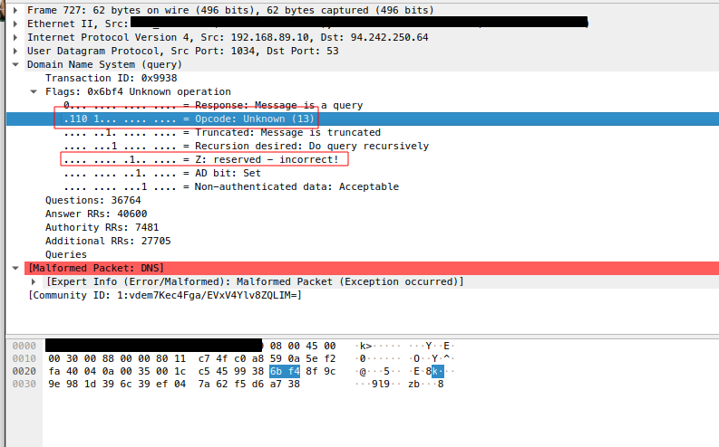
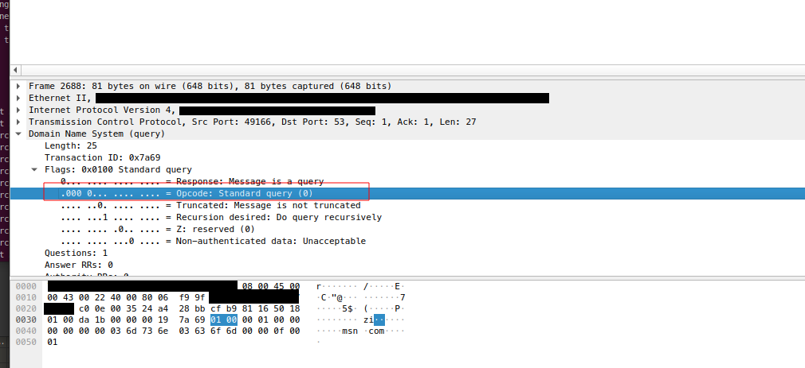
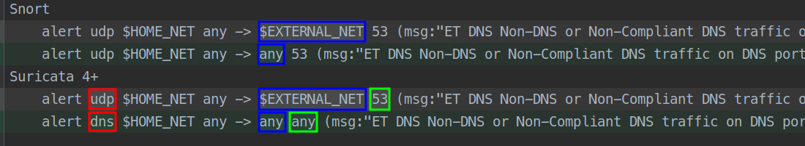
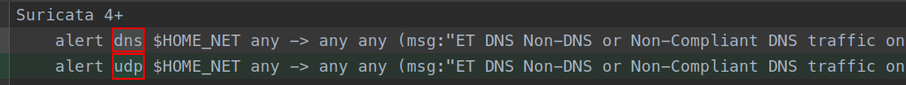
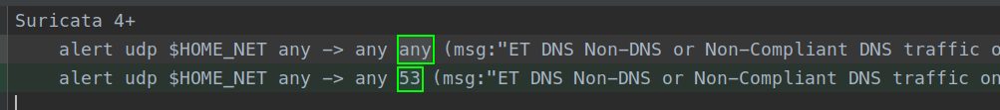

  
<sub>Sometimes, even the best laid plans, with the best intentions, have their faults.
Credit: [Garfield minus Garfield](https://garfieldminusgarfield.net/post/618917615628337152/mistake)</sub>

## Executive Summary

In an effort to modernize legacy dns rules in the emerging threats ruleset to conform with our rule style guidance,
enhance performance, and utilize Suricata’s enhanced protocol support, a rule update was published on 2022/07/15 with
updates to rules 2014702 and 2014703. The modifications resulted in several customers experiencing false positives. The
root cause of this problem is the result of these rules inspecting DNS over TCP traffic, and analyzing key bytes used to
detect the anomalies at the incorrect offsets. The issue was finally resolved by reverting these rules back to inspect
DNS over UDP port 53 payloads when revision 13 of the rules were released on 2022/07/18. We are also introducing new
rules designed to inspect DNS over TCP payloads at the correct offsets. As a part of lessons learned, Emerging Threat QA
processes are being revised to prevent a repeat of this problem in the future.

## Rule Updates, and Why Emerging Threats Performs Them

The ET ruleset has evolved over time to support both Snort and Suricata IDS engines. Initially, Snort and Suricata
shared a nearly identical rule syntax, making the publishing of rules for one platform or another very simple.

However, as time marched on and newer versions of Suricata were released more features, protocols, rule options were
added. While Snort/Suricata rules are still very closely related, there are certain features that Suricata has that
Snort 2.9.x does not have. These new features supported by Suricata can lead to more accurate rules, performance gains,
etc.

Reviewing legacy rules and modifying them to make use of new Suricata features and enhancements allows rules to trigger
more accurately and run more efficiently with less memory and/or CPU cycles used.

In addition to new features and better performance, sometimes we modify legacy rules to make use of Suricata’s enhanced
protocol support for rule writing.

## Why do these rules exist?

### 2014702 - Non-DNS or Non-Compliant DNS traffic on DNS port Opcode 8 through 15 set

This rule is meant to examine a specific bit of the UDP payload that is meant to represent DNS
opcodes. [IANA has designated opcodes 7-15 to be “unassigned”](https://www.iana.org/assignments/dns-parameters/dns-parameters.xhtml#dns-parameters-5)
. These unassigned opcodes should not be observed in normal DNS traffic. Traffic making use of these opcode values
represents DNS traffic that is “unusual” or “anomalous” in nature

### 2014703 - Non-DNS or Non-Compliant DNS traffic on DNS port Reserved Bit Set

This rule is meant to examine the reserved bit (the Z bit) within the DNS header of a query or
response.  [RFC 1035 Section 4.1.1](https://datatracker.ietf.org/doc/html/rfc1035#section-4.1.1) specifies three bits
within the DNS header as “reserved for future use” and indicates “Must be zero in all queries and
responses.”  [RFC 2065](https://datatracker.ietf.org/doc/html/rfc2065) allocates two of the bits for the AD (authentic
data) and CD (checking disabled) bits, which leaves a single bit (the Z bit) unassigned. Traffic making use of this
reserved bit represents either traffic that is not DNS or is not in compliance with the RFC.

### What do the alerts signify?

Excessive triggering of these rules could represent malicious activity – for example, DNS tunneling that may be using
the opcodes and/or DNS header bits to communicate. Or, more likely, some sort of network device that may be using
undefined DNS opcodes or bits for functions that may be proprietary or specific to the vendor’s network equipment.

When looking at the traffic associated with
the [reference md5](https://www.virustotal.com/gui/file/e4f11dbd7a741894a9a2fe88edfb862d78f6f2b86a59a313dc81bd4cfd2bbd6e)
in sid 2014702 metadata, as seen in Figure 1, the traffic being sent on UDP port 53 is not actually DNS traffic. Both
2014702 and 2014702 are intended to alert on this traffic as it is “Non-DNS traffic on a DNS port.“ This traffic appears
to be associated with the [ZeroAccess rootkit.](https://nakedsecurity.sophos.com/zeroaccess/)

  
<sub>Figure 1: An example pcap of DNS over UDP from
the [reference sample](https://www.virustotal.com/gui/file/e4f11dbd7a741894a9a2fe88edfb862d78f6f2b86a59a313dc81bd4cfd2bbd6e)
showing traffic resulting in a true positive alert due to the use of the unassigned opcode 15 and reserved bit
set. </sub>

This is the type of rule that SOC Analysts or Security engineers may wish to use for hunting activity – this may result
in finding rogue network devices, undocumented network activity that may be completely benign (but really needs to be
documented), malware, or users/systems attempting to bypass network security controls.

Please be aware that the reference blog post in both of these rules…
> http://vrt-blog.snort.org/2008/08/checking-multiple-bits-in-flag-field_29.html

…no longer seems to exist, but through use of archive.org’s wayback machine, can be found here:
> https://web.archive.org/web/20150111065614/http://vrt-blog.snort.org/2008/08/checking-multiple-bits-in-flag-field_29.html

  
<sub>Figure 2: In the screencap above, we see a standard dns query over TCP in which the opcode bits 8-15 are NOT
defined. Nor is the reserve bit set. Neither rule was intended to alert on this traffic. Take note of the Length field,
and notice that it is not present in Figure 1 (DNS over UDP)</sub>

## What’s changed?

### Revision 10 -> Revision 11

  
<sub>Figure 3: A visual difference of the modifications made to the rules on July 15th, 2022</sub>

On July 15th, 2022 at 22:05 UTC three modifications to the rules were published, as seen in Figure 3:

- Suricata
    - The protocol was modified from “udp” to the “dns” protocol.
    - The destination variable was modified from “$EXTERNAL_NET” to “any”
    - The destination port was changed from “53” to “any”
- Snort
    - The destination variable was modified from “$EXTERNAL_NET” to “any

The intention of the initial change was to modernize the rules by making use of the “dns” protocol within Suricata.
While updating the protocol, we evaluated if the rule should be updated to also inspect traffic within the internal
network ($HOME_NET) in addition to traffic leaving the internal network ($EXTERNAL_NET). By setting the destination host
variable to “any” the rules will alert on Non-DNS or Non-Compliant DNS regardless of the destination host.

The problems created by this change are described in the “Root Cause” section.

### Revision 11 -> Revision 12

  
<sub>Figure 4: A visual difference of the modifications made to the rules on July 18th, 2022 introducing revision 12.
</sub>

On July 18th, 2022 at 23:49 UTC the first attempt to correct the rule was published.

- Suricata
    - The protocol was modified from “dns” back to the “udp” protocol
    - Both the destination variable and port were kept as “any”

While the destination port was intended to be reverted to port 53, it was missed in this version of the rule, which
increased the false positive rate of these rules. This revision was published for a brief period of time.

### Revision 12 -> Revision 13 (Current)

  
<sub>Figure 5: A visual difference of the modifications made to the rules on July 18th, 2022 introducing revision 13.
</sub>

On July 19th, 2022 at 00:12 UTC, 23 minutes after Revision 12 was published, the final correction was published.

- Suricata
    - The destination variable was changed from “any” back to port 53 to further limit any future false positives
    - **This is the current version of rules 2014702 and 2014703**

Revision 13 corrected the oversight contained in revision 12 by modifying the destination port back to 53. Revision 13
is the current version of rules.

## Root Cause

### Using the “dns” protocol on a rule written only for UDP

The original versions of these two rules (See Appendix A, Revision 10) only inspect UDP payloads over port 53, while the
modified rules (Appendix A, Revision 11), inspect DNS traffic on any port, over any transport protocol. Since
traditional DNS uses both TCP and UDP for transmission, Suricata analyzes both UDP and TCP DNS traffic when the “dns”
protocol is used. In order to detect opcode and/or Reserve bit anomalies, we’re using the rule
option [`byte_test`](https://suricata.readthedocs.io/en/suricata-6.0.0/rules/payload-keywords.html?highlight=byte_test#byte-test)
at a specific offset in the data payload, checking to see if certain bits in the DNS header are set.

The problem, as shown in figure 2, created by using the “dns” protocol,, is that when DNS messages are sent over
TCP [RFC
1035 requires a two byte length field](https://datatracker.ietf.org/doc/html/rfc1035#section-4.2.2) to be prepended to
the DNS message. However, the revision 11 version of the rules,
which are inspecting both UDP and TCP, cannot account for this two byte variation of the DNS header between the
transport protocols. When the rule is inspecting TCP traffic, the byte_test operation is actually reading the
transaction id field instead of the intended bytes containing the bits for the opcode or the reserved bits resulting in
erratic behavior, and false positives.

### Human Error

In an effort to fix the issues present in revision 11, a human error was made which resulted in the incomplete
resolution and resulted in making the rules more prone to false positives.

### Quality Assurance

As a part of our rule release and update process, we have a quality assurance process that is meant to test both our new
rules and modified existing rules against battery of real-world traffic to verify that performance is deemed acceptable,
and that false positives (both the number of alerts, as well as the number of times rule context is queued for “checks”,
vs. the number of times those checks result in “hits”) are minimal. Our QA process passed these rule changes, and so the
rule updates were included in our daily release for Friday July 15th, 2022.

## Resolution

In order to resolve the situation, we have partially reverted rules 2014702 and 2014703 to analyze DNS over UDP traffic
only over port 53, while leaving the outbound destination set to “any” in revision 13 of these rules. Additionally, we
will be providing new DNS rules for anomalous DNS traffic over TCP with the same bits/opcodes set, with the correct
bytes being analyzed for anomalies.

In addition to resolving this issue, we will be introducing a more robust QA process to try and better catch anomalies
of this nature in the future as a lesson learned from this event.

### Why not use dns.opcode? (suri 5+)

Newer releases of Suricata 5.x or higher include a dns keyword
called [`dns.opcode`](https://suricata.readthedocs.io/en/suricata-5.0.0/rules/dns-keywords.html#dns-opcode). As the name
of the keyword implies, it lets rule writers create rules using DNS opcodes as a criteria. The natural question would be
to ask why we aren’t using this rule option for these particular rules. During our analysis of the false positives
reported on rules 2014702 and 2014703, we discovered [a bug](https://redmine.openinfosecfoundation.org/issues/5444)
introduced in a [recent commit](https://github.com/OISF/suricata/commit/bf0813d9f07c30cf3f8541c10561ffd6f17ef0bf) of
Suricata, current Suricata releases any DNS traffic that has an opcode greater than or equal to 7 doesn’t even register
as DNS traffic. Not to mention, through testing it has been determined that the `dns.opcode` keyword only supports an
opcode number or a negation (!) and an opcode number (e.g. alert on this opcode, or alert on any opcode but this one
opcode). Because of these limitations and problems with dns.opcode, and the fact that byte_test is supported across all
versions of Suricata 4.x and 5.x, we opted to continue using byte_test for these rules.

## Additional Recommendations and Thoughts

We are aware that several customers noticed this issue as a result of network security appliances being configured to
DROP this rule if detected in their network traffic. **Rules of this nature are meant to detect anomalies in network
traffic and are not designed to detect a specific threat. This also applies to most of the rules in the DNS, HUNTING,
INFO, POLICY, and/or USER_AGENTS rule categories as well.** If we have high confidence that a rule is indicative of
malicious activity, it will usually be placed into another category to reflect that, such as
MALWARE. [Here is a quick refresher](https://tools.emergingthreats.net/docs/ETPro%20Rule%20Categories.pdf) on the
various categories we will place rules under, and a brief description of each of those categories.

In addition to the rule category, be aware of the `classtype` metadata for rules as well. For example,
configuring `policy-violation` and/or `misc-activity` rules to dropc network traffic may not be a wise decision, while a
classtype such as `trojan-activity`, or `domain-c2` may be a better choice for dropping traffic. In the case of these
two rules, the classtype is set to `policy-violation`. For more information on available classtypes, consider referring
to your `classification.config` file included with your Snort or Suricata Emerging Threats ruleset. The
classification.config file can also be downloaded separately
from [rules.emergingthreats.net](http://rules.emergingthreats.net/).

In many cases where RFCs dictate that specific bits and opcodes for a protocol as unused, different vendors see those
unused opcodes and/or bits as an opportunity to implement network features specific to those devices. This doesn’t
necessarily mean that this activity is malicious, just “unusual” traffic that doesn’t appear to be following the
observed “rules”. As mentioned previously, these are the types of rules that SOC Analysts or Security engineers may wish
to use for hunting activity – this may result in finding rogue network devices, undocumented network activity that may
be completely benign (but really needs to be documented), or users/systems attempting to bypass network security
controls.

### External References
Emerging Threats would like to thank Micah Hausler for
an [extremely informative thread](https://twitter.com/micahhausler/status/1549092018160271364) on Twitter in which he
illustrates the problem perfectly.

### How to communicate & report rule problems to Emerging Threats

If you are experiencing problems with rules in the Emerging Threats ruleset, we are here to help – ET OPEN, or ET PRO.
Here are the best ways to contact us:

- Feedback portal at: https://feedback.emergingthreats.net/feedback
- Email at: support@emergingthreats.net
- Join The Emerging Threats Mailing List at: https://lists.emergingthreats.net/mailman/listinfo/
- Find us on twitter: [@ET_Labs](twitter.com/et_labs)
- Send us a twitter DM for access to our growing ET Discord
- While it's not quite ready just yet, we will be launching a [discourse](https://www.discourse.org/) community in the
  near future. Stay tuned for more information


## Appendix A
### Suricata
- Revision 10
  ```
  alert udp $HOME_NET any -> $EXTERNAL_NET any (msg:"ET DNS Non-DNS or Non-Compliant DNS traffic on DNS port Opcode 8 through 15 set"; content:!"7PYqwfzt"; depth:8; content:!"r6fnvWj8"; depth:8; byte_test:1,&,64,2; threshold: type limit, count 1, seconds 120, track by_dst; reference:md5,a56ec0f9bd46f921f65e4f6e598e5ed0; reference:url,vrt-blog.snort.org/2008/08/checking-multiple-bits-in-flag-field_29.html; classtype:policy-violation; sid:2014702; rev:10; metadata:created_at 2012_05_04, updated_at 2020_10_06;)
  alert udp $HOME_NET any -> $EXTERNAL_NET 53 (msg:"ET DNS Non-DNS or Non-Compliant DNS traffic on DNS port Reserved Bit Set"; content:!"7PYqwfzt"; depth:8; content:!"r6fnvWj8"; depth:8; byte_test:1,&,64,3; threshold: type limit, count 1, seconds 120, track by_dst; reference:md5,a56ec0f9bd46f921f65e4f6e598e5ed0; reference:url,vrt-blog.snort.org/2008/08/checking-multiple-bits-in-flag-field_29.html; classtype:policy-violation; sid:2014703; rev:10; metadata:created_at 2012_05_04, updated_at 2020_10_06;)
  ```
- Revision 11
  ```
  alert dns $HOME_NET any -> any any (msg:"ET DNS Non-DNS or Non-Compliant DNS traffic on DNS port Opcode 8 through 15 set"; content:!"7PYqwfzt"; depth:8; content:!"r6fnvWj8"; depth:8; byte_test:1,&,64,2; threshold: type limit, count 1, seconds 120, track by_dst; reference:md5,a56ec0f9bd46f921f65e4f6e598e5ed0; reference:url,vrt-blog.snort.org/2008/08/checking-multiple-bits-in-flag-field_29.html; classtype:policy-violation; sid:2014702; rev:11; metadata:created_at 2012_05_04, former_category DNS, performance_impact Significant, updated_at 2022_07_15;)
  alert dns $HOME_NET any -> any any (msg:"ET DNS Non-DNS or Non-Compliant DNS traffic on DNS port Reserved Bit Set"; content:!"7PYqwfzt"; depth:8; content:!"r6fnvWj8"; depth:8; byte_test:1,&,64,3; threshold: type limit, count 1, seconds 120, track by_dst; reference:md5,a56ec0f9bd46f921f65e4f6e598e5ed0; reference:url,vrt-blog.snort.org/2008/08/checking-multiple-bits-in-flag-field_29.html; classtype:policy-violation; sid:2014703; rev:11; metadata:created_at 2012_05_04, former_category DNS, performance_impact Significant, updated_at 2022_07_15;)
  ```
- Revision 12
  ```
  alert udp $HOME_NET any -> any any (msg:"ET DNS Non-DNS or Non-Compliant DNS traffic on DNS port Opcode 8 through 15 set"; content:!"7PYqwfzt"; depth:8; content:!"r6fnvWj8"; depth:8; byte_test:1,&,64,2; threshold: type limit, count 1, seconds 120, track by_dst; reference:md5,a56ec0f9bd46f921f65e4f6e598e5ed0; reference:url,vrt-blog.snort.org/2008/08/checking-multiple-bits-in-flag-field_29.html; classtype:policy-violation; sid:2014702; rev:12; metadata:created_at 2012_05_04, former_category DNS, performance_impact Significant, updated_at 2022_07_18;)
  alert udp $HOME_NET any -> any any (msg:"ET DNS Non-DNS or Non-Compliant DNS traffic on DNS port Reserved Bit Set"; content:!"7PYqwfzt"; depth:8; content:!"r6fnvWj8"; depth:8; byte_test:1,&,64,3; threshold: type limit, count 1, seconds 120, track by_dst; reference:md5,a56ec0f9bd46f921f65e4f6e598e5ed0; reference:url,vrt-blog.snort.org/2008/08/checking-multiple-bits-in-flag-field_29.html; classtype:policy-violation; sid:2014703; rev:12; metadata:created_at 2012_05_04, former_category DNS, performance_impact Significant, updated_at 2022_07_18;)
  ```
- Revision 13
  ```
  alert udp $HOME_NET any -> any 53 (msg:"ET DNS Non-DNS or Non-Compliant DNS traffic on DNS port Opcode 8 through 15 set"; content:!"7PYqwfzt"; depth:8; content:!"r6fnvWj8"; depth:8; byte_test:1,&,64,2; threshold: type limit, count 1, seconds 120, track by_dst; reference:md5,a56ec0f9bd46f921f65e4f6e598e5ed0; reference:url,vrt-blog.snort.org/2008/08/checking-multiple-bits-in-flag-field_29.html; classtype:policy-violation; sid:2014702; rev:13; metadata:created_at 2012_05_04, former_category DNS, performance_impact Significant, updated_at 2022_07_18;)
  alert udp $HOME_NET any -> any 53 (msg:"ET DNS Non-DNS or Non-Compliant DNS traffic on DNS port Reserved Bit Set"; content:!"7PYqwfzt"; depth:8; content:!"r6fnvWj8"; depth:8; byte_test:1,&,64,3; threshold: type limit, count 1, seconds 120, track by_dst; reference:md5,a56ec0f9bd46f921f65e4f6e598e5ed0; reference:url,vrt-blog.snort.org/2008/08/checking-multiple-bits-in-flag-field_29.html; classtype:policy-violation; sid:2014703; rev:13; metadata:created_at 2012_05_04, former_category DNS, performance_impact Significant, updated_at 2022_07_18;)
  ```
### Snort
- Revision 10
  ```
  alert udp $HOME_NET any -> $EXTERNAL_NET 53 (msg:"ET DNS Non-DNS or Non-Compliant DNS traffic on DNS port Opcode 8 through 15 set"; content:!"7PYqwfzt"; depth:8; content:!"r6fnvWj8"; depth:8; byte_test:1,&,64,2; threshold: type limit, count 1, seconds 120, track by_dst; reference:md5,a56ec0f9bd46f921f65e4f6e598e5ed0; reference:url,vrt-blog.snort.org/2008/08/checking-multiple-bits-in-flag-field_29.html; classtype:policy-violation; sid:2014702; rev:10; metadata:created_at 2012_05_04, updated_at 2020_10_06;)
  alert udp $HOME_NET any -> $EXTERNAL_NET 53 (msg:"ET DNS Non-DNS or Non-Compliant DNS traffic on DNS port Reserved Bit Set"; content:!"7PYqwfzt"; depth:8; content:!"r6fnvWj8"; depth:8; byte_test:1,&,64,3; threshold: type limit, count 1, seconds 120, track by_dst; reference:md5,a56ec0f9bd46f921f65e4f6e598e5ed0; reference:url,vrt-blog.snort.org/2008/08/checking-multiple-bits-in-flag-field_29.html; classtype:policy-violation; sid:2014703; rev:10; metadata:created_at 2012_05_04, updated_at 2020_10_06;)
  ```
- Revision 11
  ```
  alert udp $HOME_NET any -> any 53 (msg:"ET DNS Non-DNS or Non-Compliant DNS traffic on DNS port Opcode 8 through 15 set"; content:!"7PYqwfzt"; depth:8; content:!"r6fnvWj8"; depth:8; byte_test:1,&,64,2; threshold: type limit, count 1, seconds 120, track by_dst; reference:md5,a56ec0f9bd46f921f65e4f6e598e5ed0; reference:url,vrt-blog.snort.org/2008/08/checking-multiple-bits-in-flag-field_29.html; classtype:policy-violation; sid:2014702; rev:11; metadata:created_at 2012_05_04, former_category DNS, performance_impact Significant, updated_at 2022_07_15;)
  alert udp $HOME_NET any -> any 53 (msg:"ET DNS Non-DNS or Non-Compliant DNS traffic on DNS port Reserved Bit Set"; content:!"7PYqwfzt"; depth:8; content:!"r6fnvWj8"; depth:8; byte_test:1,&,64,3; threshold: type limit, count 1, seconds 120, track by_dst; reference:md5,a56ec0f9bd46f921f65e4f6e598e5ed0; reference:url,vrt-blog.snort.org/2008/08/checking-multiple-bits-in-flag-field_29.html; classtype:policy-violation; sid:2014703; rev:11; metadata:created_at 2012_05_04, former_category DNS, performance_impact Significant, updated_at 2022_07_15;)
  ```

